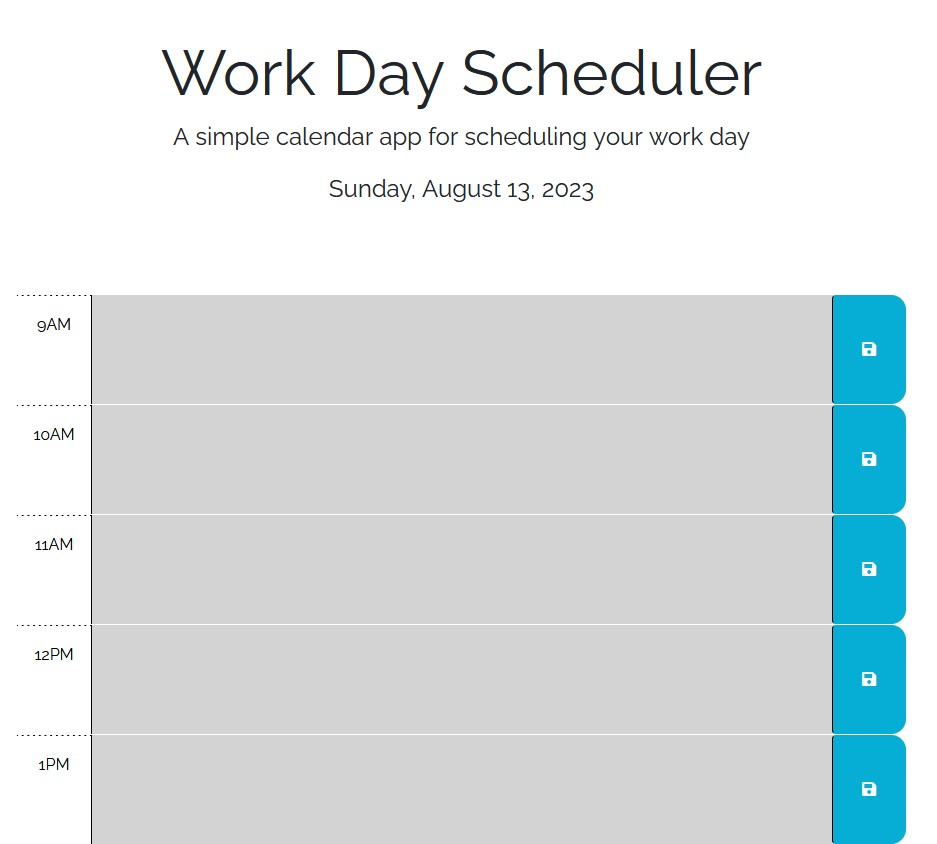

# Module 5 Weekly Challenge - Hourly Work Day Scheduler

## Description

Web development has regularly proven itself to be a complex and hectic field to work in, and as such, it is important to keep track of what exactly needs to be done and when. Thus, this web application allows for scheduling "events", whether they be deadlines to complete tasks, notes, or actual events, such as meetings, in an hour-by-hour format for a standard workday.

## Usage

Make use of the scheduler here;

https://average-kirigiri-enjoyer.github.io/challenge-5-hourly-work-scheduler/

At the top of the page, there will be a header with a title and subtitle followed by today's date.

Below will be a series of blocks with three main sections; an hour title on the left, an event box in the middle, and a save button on the right. The hour title indicates which hour the block is reserved for. The event box is where event data will be displayed, which can be modified by clicking and typing whatever you like within. The save button will send the event data of the attached block to local storage, such that it will be saved even if the page is reloaded or closed.

The background colour of each event box will vary depending on how far it currently is into the work day. Blocks for hours that have already passed will be grey, the current hour block will be red, and future blocks will be green.

## Preview

## License

Operates under a standard MIT license, refer to the LICENSE file in the repository for more information.
